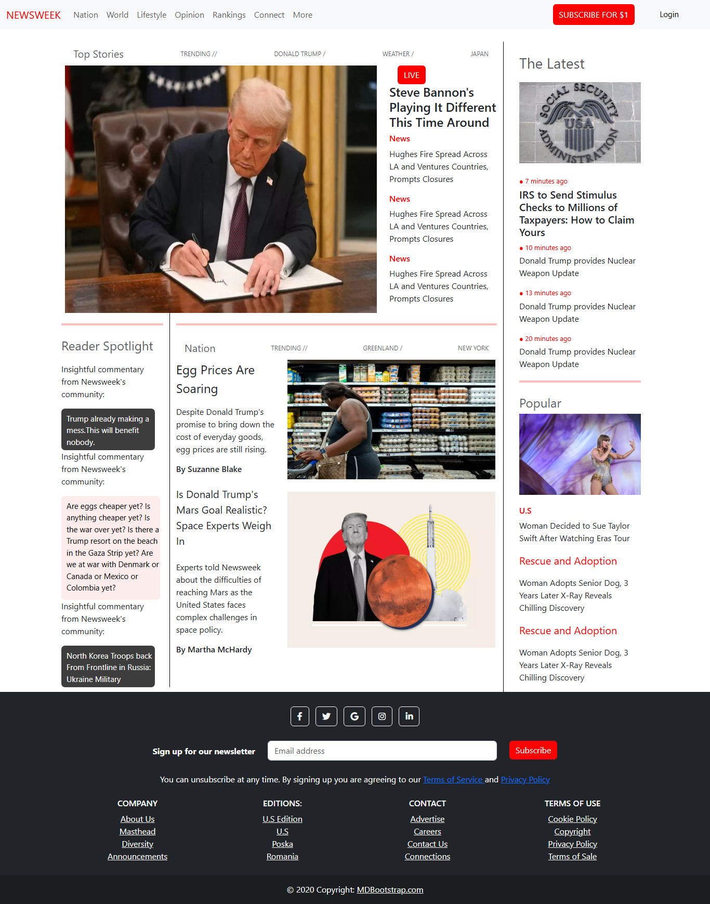

# Newsweek Homepage Clone

## This is a clone of the Newsweek homepage. It was built using bootstrap framework, it was majorly done for learning purpose . The aim was to replicate the structure and styling of the official Newsweek homepage, focusing on layout, responsiveness and overall user interface design.

## Features
- Fixed Navigation Bar
- Responsive Grid Layout
- Content Layout

## Screenshots

## Built With
- HTML
- CSS
- BOOTSTRAP 5

## Installation
To get a local copy up and running, follow these steps.
1. Clone the repository with git clone "https://github.com/Princessglory/Newsweek-clone.git"
2. Go inside this repository by typing cd Newsweek-clone

## Usage
1.Clone the project to your local machine.
2. Open index.html within your browser.

## Contributing
Contributions, issues and feature requests are welcome!
 Start by:
- Forking the project
- Cloning the project to your local machine
- cd into the project directory
- Run git checkout -b your-branch-name
- Make your contribution
- Push your branch up to your forked repository
- Open a Pull Request with a detailed description to the develop branch of the original project for a review.
